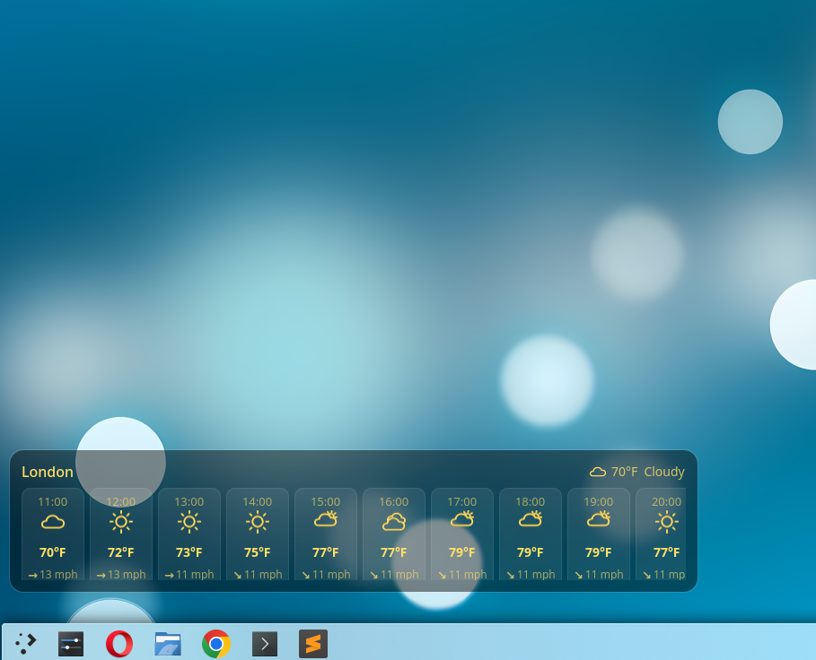
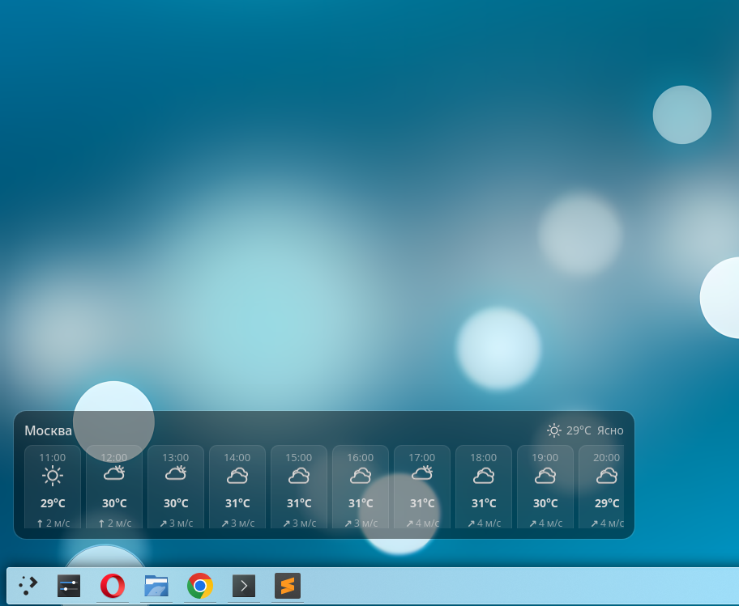
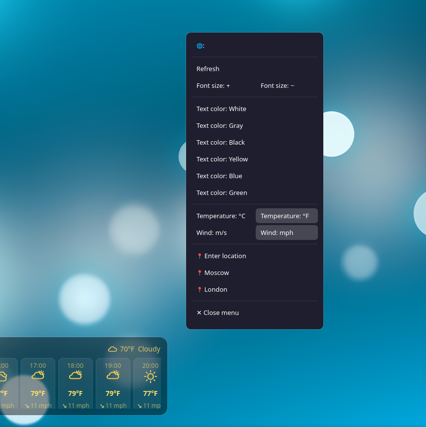
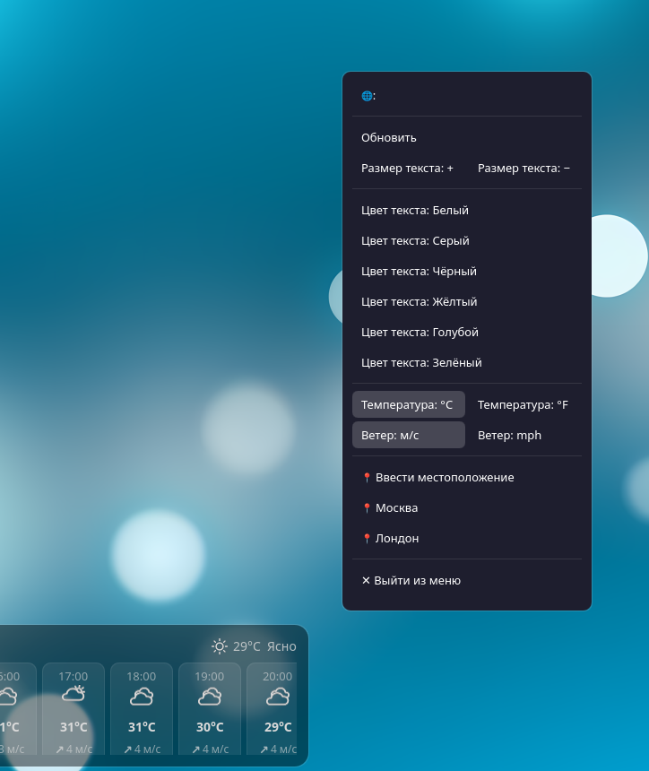

# Weather Plasmoid

A lightweight, transparent hourly weather widget for **KDE Plasma 6**.

🇷🇺 [Читать на русском](README.ru.md)


## Features

- Transparent, minimalist widget that blends into your desktop
- Hourly weather forecast
- Automatic location detection via IP (no setup required)
- Manual location override (city / coordinates)
- Multi-language support
- Weather data provided by [MET Norway](https://api.met.no) — free, no API key required

## Screenshots






## Requirements

- KDE Plasma 6.0+
- Qt 6
- CMake 3.20+
- KDE Frameworks 6 (Plasma and standard KF6 QML dependencies)
- A C++ compiler (GCC or Clang)

## Installation

```bash
git clone https://github.com/zuzayka/weather-plasmoid.git
cd weather-plasmoid
./build.sh
./install.sh
```

The install script:
1. Installs the plasmoid package into `~/.local/share/plasma/plasmoids/`
2. Copies the compiled backend plugin into the Qt6 QML import path (requires `sudo`)
3. Restarts `plasmashell`

After installation, right-click your desktop or panel → **Add Widgets** → search for **"Weather Plasmoid"**.

## Uninstallation

```bash
rm -rf ~/.local/share/plasma/plasmoids/org.kde.weather-plasmoid
sudo rm -f /usr/lib/qt6/qml/org/kde/weatherbackend/libweather-backend-plugin.so
kquitapp6 plasmashell && plasmashell &
```

## How it works

- On first run (or if no location is set manually), the widget queries [ip-api.com](http://ip-api.com/) to determine an approximate location from your IP address.
- Weather data is then fetched from the [MET Norway Locationforecast API](https://api.met.no/weatherapi/locationforecast/2.0/documentation) — a free service requiring no registration, only a valid `User-Agent` header, which is already implemented in the code.
- The automatically detected location can be overridden with a fixed one in the widget settings.

## Configuration

Open the widget settings (right-click → **Configure Weather Plasmoid...**) to:
- Set a fixed location (city + coordinates)
- Change the display language

## Project structure

```
weather-plasmoid/
├── .gitignore
├── build.sh                  # Build script
├── install.sh                 # Install script
├── CMakeLists.txt              # Root CMake config
├── LICENSE
├── README.md
├── README.ru.md
├── screenshots/                # Screenshots used in the README
│   ├── widget-ru.png
│   ├── widget-en.png
│   ├── widget-settings-ru.png
│   └── widget-settings-en.png
├── package/                     # Plasmoid package
│   ├── metadata.json
│   └── contents/
│       ├── config/
│       │   └── main.xml
│       └── ui/                   # QML frontend
│           ├── main.qml
│           ├── WeatherCard.qml
│           ├── WeatherModel.qml
│           ├── SettingsPanel.qml
│           ├── configGeneral.qml
│           ├── LanguageDialog.qml
│           ├── LocationDialog.qml
│           └── icons/              # Weather condition icons (SVG)
└── weather-backend/               # Native C++ backend plugin
    ├── CMakeLists.txt
    └── src/
        ├── plugin.cpp
        ├── plugin.json
        ├── WeatherBackend.cpp
        └── WeatherBackend.h
```

## Contributing

Issues and pull requests are welcome. If you'd like to add a feature or fix a bug, feel free to open an issue first to discuss the change.

## License

This project is licensed under the **GPL-2.0-or-later** license — see [LICENSE](LICENSE) for details.

## Credits

- Weather data: [MET Norway](https://api.met.no)
- Weather icons: [Yr.no weather symbols](https://github.com/metno/weathericons)
- IP geolocation: [ip-api.com](http://ip-api.com)
